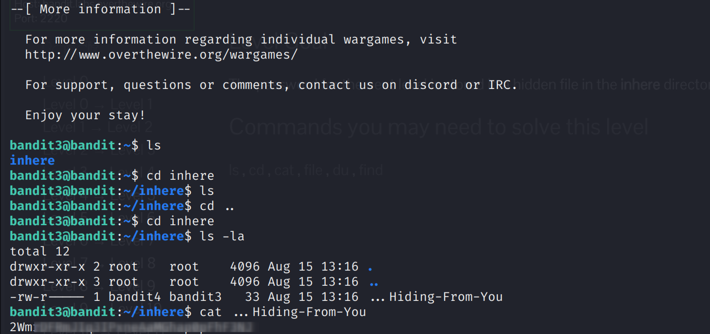

Bandit Level 3 → 4

Goal:
- Retrieve the password for Level 4.
- The password is stored in a **hidden file** named `...Hiding-From-You` inside the 'inhere' directory in Level 3’s home directory.

Commands You May Need:
ls, cd, cat, file, du, find

Steps:
1. Log in as bandit3 (Level 3) via SSH.
2. Move into the 'inhere' directory:
   cd inhere
3. List all files, including hidden ones:
   ls -la
   # Heads up: The hidden file is named `...Hiding-From-You`
4. Display the contents of the hidden file:
   cat .Hiding-From-You

Explanation:
- Hidden files in Linux start with a dot (`.`) and are not listed by default.  
- Using `ls -la` ensures we see all hidden files.  
- The `cat` command reads the file to reveal the password.  

Result:
- The hidden file `...Hiding-From-You` contains the password for Level 4.
- In this repo, the password is **blurred for security** in screenshots.

Screenshot:

- The screenshot shows only the commands; password is blurred.
