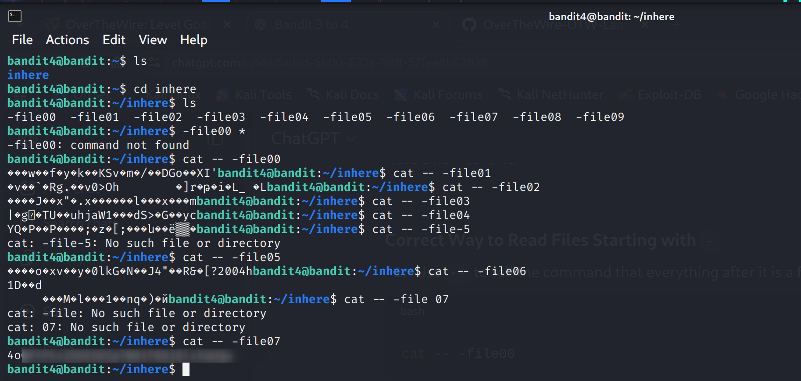

Bandit Level 4 → 5

Goal:
- Retrieve the password for Level 5.
- The password is stored in the **only human-readable file** in the `inhere` directory in Level 4’s home directory.
- Tip: If your terminal output is messed up after `cat`, you can use the `reset` command.

Commands You May Need:
ls, cd, cat, file, du, find

Steps:
1. Log in as bandit4 (Level 4) via SSH.
2. Move into the 'inhere' directory:
   cd inhere
3. List all files:
   ls
   # Output: -file00  -file01  -file02 ... -file09
4. Identify the human-readable file:
   file -- -file*
   # The file marked as ASCII text is the password file.
5. Display the contents of the human-readable file:
   cat -- -fileXX
   # Replace -fileXX with the actual human-readable file (e.g., -file07)

Explanation:
- Filenames starting with `-` are treated as **options** by Linux commands.  
- Using `--` before the filename tells the command to stop parsing options and treat everything after as a filename.  
- This avoids errors like `-file00: command not found`.  
- `file -- -file*` helps find the human-readable file among many binary-looking files.

Result:
- The human-readable file contains the password for Level 5.
- In this repo, the password is **blurred for security** in screenshots.

Screenshot(ignore errors):

- The screenshot shows only the commands; password is blurred.
