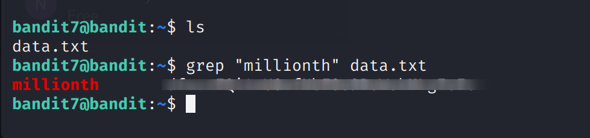

Bandit Level 7 → Level 8

Goal:
The password for the next level is stored in the file data.txt next to the word "millionth".

Steps and Explanation:

1. Verify the file exists:
ls
- This lists files in the current directory. You should see data.txt.

2. Search for the word "millionth" in the file:
grep "millionth" data.txt
- grep searches for the pattern "millionth" in data.txt.
- It prints the line containing the pattern.
- The password is located immediately after the word "millionth".

3. Extract the password:
- From the grep output, the password is the word after "millionth".

Level 7 → 8 Password:
Password is blurred for reference

Output Screenshot:

