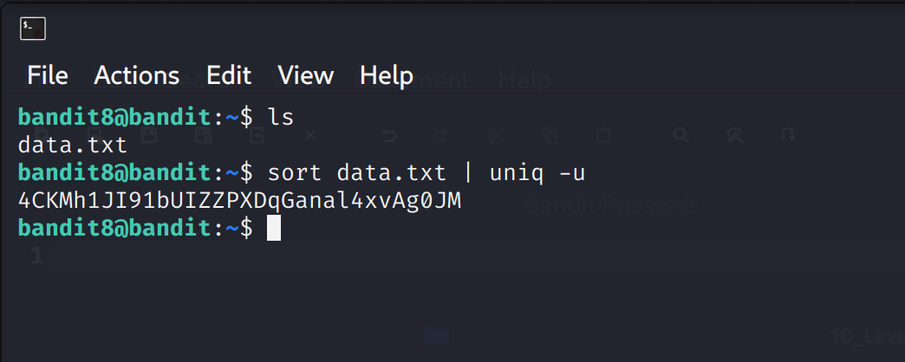

Bandit Level 8 → Level 9

Goal:
The password for the next level is stored in the file data.txt and is the only line of text that occurs only once.

Steps and Explanation:

1. Verify the file exists:
ls
- This lists files in the current directory. You should see data.txt.

2. Inspect the file (optional):
cat data.txt
- This shows the contents of data.txt.
- You will notice that most lines repeat multiple times.

3. Find the unique line (the password):
sort data.txt | uniq -u
- Explanation:
- sort data.txt → sorts all lines so that duplicate lines are consecutive.
- uniq -u → prints only lines that occur exactly once.
- The output of this command is the password for Level 9.

4. Handling non-printable or encoded text (if necessary):
strings data.txt | sort | uniq -u
- strings extracts human-readable text from binary or encoded files.
- This ensures you can still find the unique line if the file contains non-text characters.

Level 8 → 9 Password:
Password is blurred for reference

Output Screenshot:

