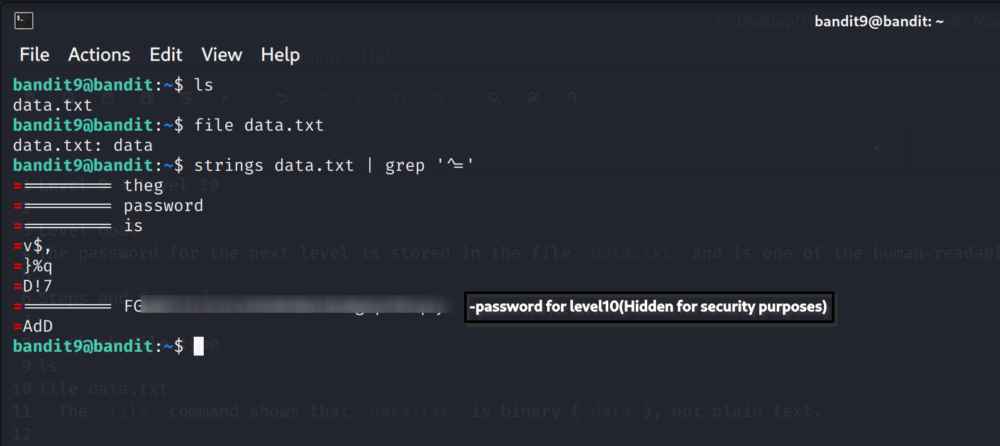

Level 9 → Level 10

Level Goal
The password for the next level is stored in the file `data.txt` and is one of the human-readable strings, preceded by several '=' characters.

Steps and Commands

1. Check file type
ls
file data.txt
- The `file` command shows that `data.txt` is binary (`data`), not plain text.

2. Extract readable strings
strings data.txt
- `strings` prints all printable characters in a binary file to find human-readable content.

3. Filter lines with '='
strings data.txt | grep '^='
- `grep '^='` selects only lines starting with '=' as hinted in the level goal.
- The password is the string after the '=' characters.

Level 9-10 Password
> Password is blurred for security in the screenshot

Explanation
- `strings` is used to ignore binary content and extract readable text.
- `grep '^='` isolates the line containing the password according to the hint.
- This ensures you get the exact password without extra noise.
