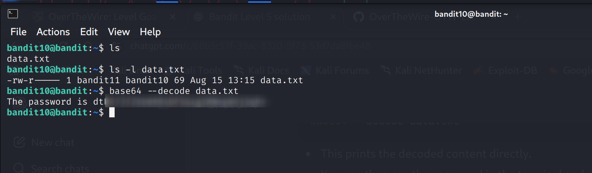

Level 10 → Level 11

Level Goal
The password for the next level is stored in the file `data.txt`, which contains base64 encoded data.

Steps and Commands

1. Check file type
ls
file data.txt
- The `file` command shows that `data.txt` is ASCII text.

2. Decode base64 content directly
base64 --decode data.txt
- Since some directories may not allow creating new files, decoding directly to the terminal avoids permission issues.
- This prints the decoded content directly so you can read the password.

3. Optional: decode to a file in a writable folder
mkdir mydecode
base64 --decode data.txt > mydecode/decoded.txt
cat mydecode/decoded.txt
- Creates a subfolder `mydecode` where you have write permissions.
- Saves decoded content for inspection.

Level 10-11 Password
> Password is blurred for security in the screenshot

Explanation
- `base64 --decode` converts encoded data back into readable text.
- Printing to terminal avoids writing in directories without permission.
- Creating a subfolder in your home directory ensures you can save decoded content safely.
