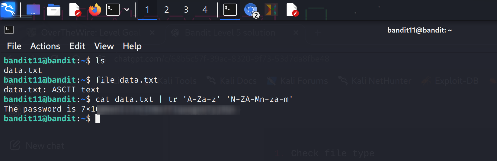

Level 11 → Level 12

Level Goal
The password for the next level is stored in the file `data.txt`, where all lowercase (a-z) and uppercase (A-Z) letters have been rotated by 13 positions (ROT13).

Steps and Commands

1. Check file type
ls
file data.txt
- `file` helps determine if the file is plain text or binary.

2. Decode ROT13
cat data.txt | tr 'A-Za-z' 'N-ZA-Mn-za-m'
- `tr` translates each letter by 13 positions (ROT13).  
- ROT13 is a simple letter substitution cipher: A↔N, B↔O, …, a↔n, b↔o, etc.

3. View the decoded password
- The command prints the password directly in the terminal.  
- You can copy it for the next level.

Level 11-12 Password
> Password is blurred for security in the screenshot

Explanation
- `tr` is used to reverse the ROT13 encoding.  
- ROT13 affects only letters; numbers, symbols, and whitespace remain unchanged.  
- This ensures you extract the exact password without altering the file.
