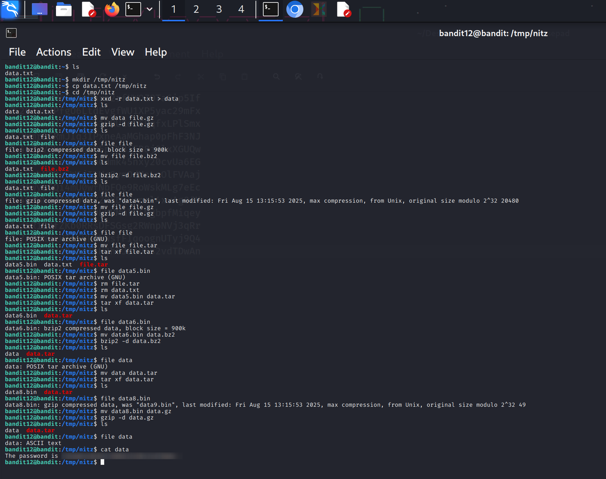

Bandit Level 12 → 13 Workflow

Step 1: Setup a temporary workspace to keep the home directory clean

mkdir /tmp/nitz
cp data.txt /tmp/nitz
cd /tmp/nitz

Step 2: Convert the hex dump back to binary:

xxd -r data.txt > file.gz   (Converts hex to binary, resulting in a gzip file)

Step 3: Decompress the first gzip layer

gzip -d file.gz             (Decompress gzip to reveal next file layer)
file file                   (Identify the type of decompressed file)
mv file file.bz2            (Rename according to compression type for clarity)

Step 4: Decompress bzip2 layer

bzip2 -d file.bz2
file file                   (Check the next file type; it is gzip)
mv file file.gz             (Rename for next decompression step)

Step 5: Decompress second gzip layer

gzip -d file.gz
file file                   (Identify the file type; it is a tar archive)
mv file file.tar            (Rename to indicate it is a tar archive)

Step 6: Extract the tar archive

tar xf file.tar
file data5.bin              (Check type of extracted file; it is another tar)
mv data5.bin data.tar
tar xf data.tar             (Extract nested tar contents)

Step 7: Handle nested bzip2 inside tar

file data6.bin              (Check type; it is bzip2)
mv data6.bin data.bz2
bzip2 -d data.bz2
file data                   (Next type is tar)
mv data data.tar
tar xf data.tar             (Extract final tar archive)

Step 8: Decompress the final gzip layer

file data8.bin              (Identify type; it is gzip)
mv data8.bin data.gz
gzip -d data.gz

Step 9: Retrieve the password
cat data                    (Displays the password for Bandit Level 13)

Notes:
Use the 'file' command after each extraction or decompression to identify the file type.
Rename files according to their type (.gz, .bz2, .tar) to keep the workflow organized.
Always work in a temporary folder to avoid clutter in the home directory.
Hex dump conversion using 'xxd -r' is necessary before any decompression or extraction.
Repeat decompression and extraction until ASCII text is revealed.

Screenshot Reference for the Complete Workflow:

