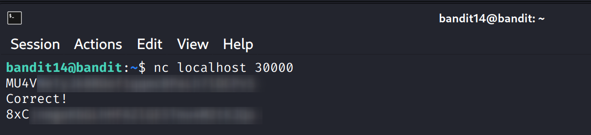

Bandit OTW Notes – Level 14 to 15

Goal: Retrieve the password for Bandit15 by submitting Bandit14’s password to port 30000 on localhost.

Steps:

1. Use Netcat (nc) to send the current level’s password to the service on port 30000:
nc localhost 30000

2. Enter the Bandit14 password (e.g., ********) when prompted. The service will return the Bandit15 password (e.g., ********).

Alternative tools that could be used for connecting to the port include:
- telnet
- openssl s_client
- ssh (if applicable)
- nmap (for port scanning/discovery)

Screenshot reference:

Notes:
- This level introduces a simple port-based challenge, where the password is sent to a service listening on a specific port.
- Always make sure you are connected to the correct host (localhost) and port (30000) when submitting the password.
- Netcat is the simplest and most commonly used tool for this level.
- All passwords are masked for security.
