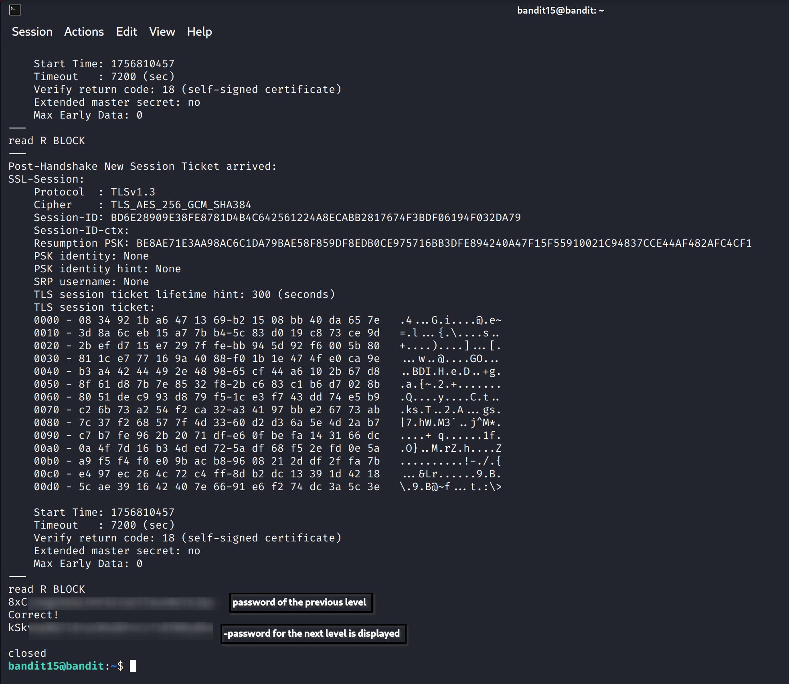

Bandit Level 15 → Level 16

Level Goal:
The password for the next level can be retrieved by submitting the password of the current level to port 30001 on localhost using SSL/TLS encryption.

Approach:
1. Connect to port 30001 using openssl s_client with SSL/TLS support.
   Command:
   openssl s_client -connect localhost:30001

   Screenshot Reference:
   

2. When prompted, paste the Bandit 15 password.
   The server will return the password for Bandit 16.

   Screenshot Reference:
   

Notes:
- If you see messages like “DONE”, “RENEGOTIATING” or “KEYUPDATE”, it means the connection is still alive, but the required password has already been displayed.
- Passwords in screenshots are blurred for security.
