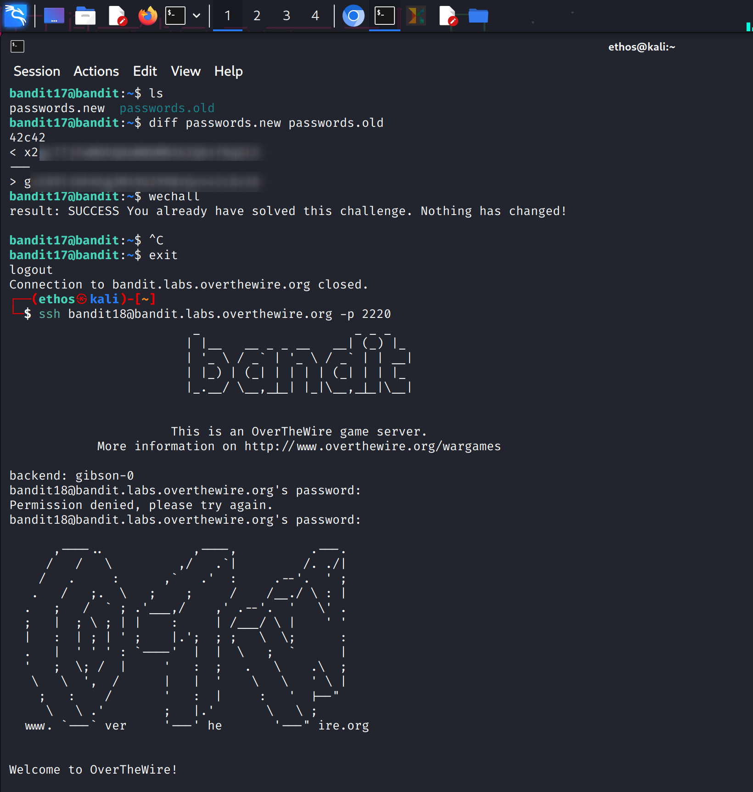

## Bandit Level 17 → 18

**Objective:** Retrieve the password for Bandit level 18 by identifying the difference between two files.

**Procedure:**  
1. **List files** in the home directory with `ls`. You should see `passwords.old` and `passwords.new`.  
2. **Compare the files** to locate the password using `diff passwords.old passwords.new`. The line following the `>` symbol is the password for the next level.  
3. **Access Bandit level 18** by executing `ssh bandit18@bandit.labs.overthewire.org -p 2220` and entering the password obtained from the previous step.  

**Important Notes:**  
- Only the differing line between the two files represents the password.  
- This approach ensures you accurately retrieve the next-level password without manually inspecting both files.  

**Screenshot Reference:**  

