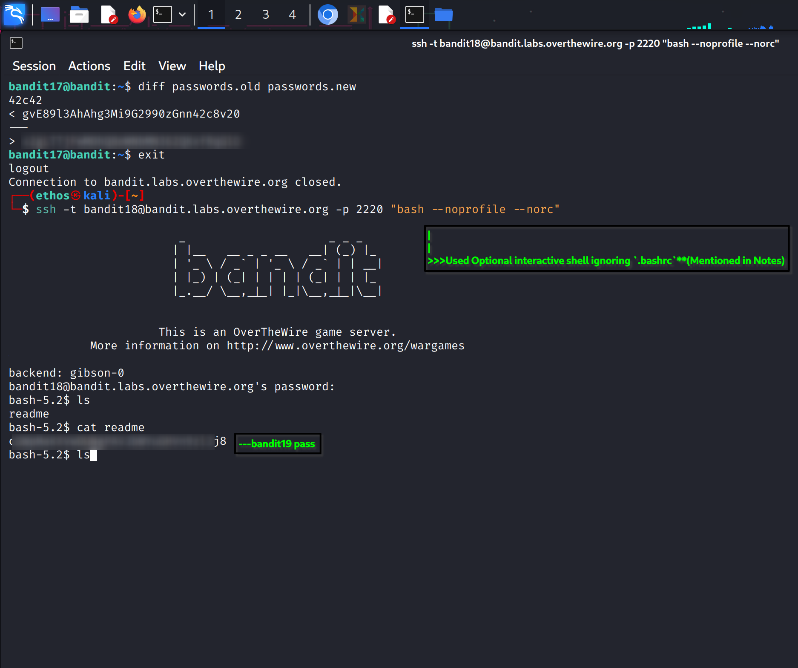

## Bandit Level 18 → 19

**Objective:** Retrieve the password for Bandit level 19 while bypassing the automatic logout triggered by `.bashrc`.

**Level Goal:**  
The password for the next level is stored in a file named `readme` in the home directory of **bandit18**. `.bashrc` logs you out immediately on interactive login.

**Commands You May Need:**  
`ssh`, `ls`, `cat`

**Procedure:**  
1. **Use the password obtained from Level 17 → 18** to access bandit18.  

2. **Bypass `.bashrc` by executing a command directly**:  
`ssh bandit18@bandit.labs.overthewire.org -p 2220 /bin/cat readme`  
- The output is the **password for bandit19**.

3. **Optional interactive shell ignoring `.bashrc`**:  
`ssh -t bandit18@bandit.labs.overthewire.org -p 2220 "bash --noprofile --norc"`  
- Then navigate and run:  
`ls`  
`cat readme`  

**Notes:**  
- Avoid normal interactive login — `.bashrc` will log you out immediately.  
- The `readme` file contains only the line needed for the next level.

**Screenshot Reference:**  

