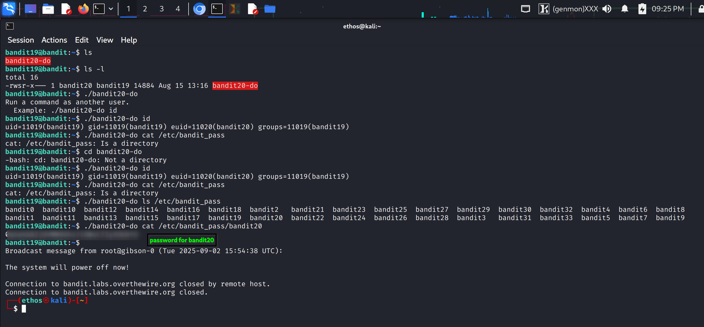

## Bandit Level 19 → 20

**Objective:** Retrieve the password for Bandit level 20 using the setuid binary in the home directory.

**Level Goal:**  
In the home directory, there is a **setuid binary** named `bandit20-do`. Executing this binary allows you to run commands as the next user (`bandit20`). The password for bandit20 is stored in `/etc/bandit_pass/bandit20`.

**Commands You May Need:**  
`ls`, `ls -l`, `./bandit20-do`, `cat`

**Procedure:**  
1. Check the contents of the home directory:  
```bash
ls
```
Output:
```
bandit20-do
```

2. Check the file permissions:  
```bash
ls -l
```
Output:
```
-rwsr-x--- 1 bandit20 bandit19 14884 Aug 15 13:16 bandit20-do
```
- `s` indicates this is a **setuid binary** running as `bandit20`.

3. Execute the binary without arguments to see usage instructions:  
```bash
./bandit20-do
```
Output:
```
Run a command as another user.
Example: ./bandit20-do id
```

4. Verify it runs as bandit20:  
```bash
./bandit20-do id
```
Output:
```
uid=11019(bandit19) gid=11019(bandit19) euid=11020(bandit20) groups=11019(bandit19)
```

5. List `/etc/bandit_pass` to find the correct file:  
```bash
./bandit20-do ls /etc/bandit_pass
```
- You will see files named after all users: `bandit0, bandit1, ..., bandit20, ...`

6. Read the password file for bandit20:  
```bash
./bandit20-do cat /etc/bandit_pass/bandit20
```
- This outputs the **password for Bandit level 20** (removed here for security).

**Notes:**  
- `bandit20-do` is a **setuid binary**, allowing commands to run with the privileges of bandit20.  
- `/etc/bandit_pass` is a **directory**, so you must access the specific file for the next user.  
- Any command run with `./bandit20-do <command>` executes **as bandit20**.

**Screenshot Reference:**  

