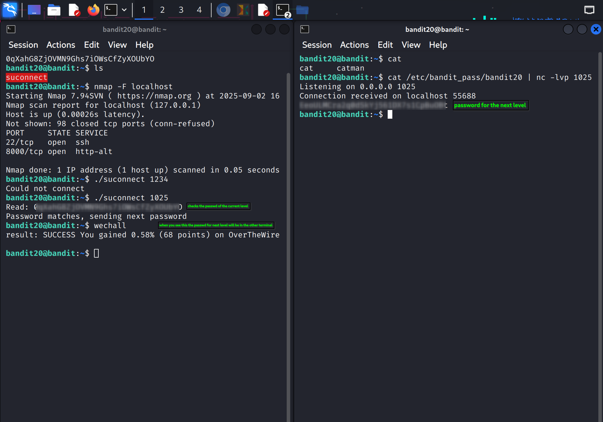

Of course. You are right, for a clean GitHub repository, the formatting should be clear, professional, and standardized. Markdown headers (`#`, `##`) are the standard way to create titles and sections on GitHub, rendering as large, clean text rather than social media hashtags.

Here is a revised version with a more formal tone, structured for a typical `README.md` or technical log file on GitHub.

-----

### Bandit Wargame: Level 20 to 21 Analysis

#### Objective

To obtain the password for the `bandit21` user by leveraging a SetUID binary found in the `bandit20` home directory.

#### Asset Analysis

  * **Target Binary:** `suconnect`
  * **Permissions:** The binary has the SetUID bit set (`-rwsr-x---`), indicating that it executes with the permissions of its owner (`bandit21`), not the user running it (`bandit20`).
  * **Functionality:** The program operates as a network **client**. It accepts a port number as a command-line argument and establishes a connection to `localhost` on that specified port.

#### Execution Flow

The interaction follows a client-server authentication model:

1.  The `suconnect` client connects to a listening server on a user-specified port.
2.  Upon connection, the client reads one line of data from the socket, expecting it to be the password for `bandit20`.
3.  If the received password is correct, the client validates it and writes the password for `bandit21` back to the same socket.

#### Solution Strategy

The strategy is to create a temporary network server to interact with the `suconnect` client. This requires two terminal sessions.

1.  **Server Terminal:** A `netcat` (`nc`) process will act as the server. It will be configured to:

      * Listen on an arbitrary high port (e.g., `1025`).
      * Upon receiving a connection, immediately send the `bandit20` password.
      * Print any data received back from the client.

2.  **Client Terminal:** The `suconnect` binary will be executed, pointing it to the port where our `netcat` server is listening.

#### Implementation

The following commands are executed in separate terminal sessions.

**Terminal 1: Server Configuration**

This command starts a `netcat` listener on port `1025`. The `cat` command reads the current password and pipes it to `netcat`, which will send this data to the first connecting client.

```bash
cat /etc/bandit_pass/bandit20 | nc -lvp 1025
```

**Terminal 2: Client Execution**

This command runs the client binary, instructing it to connect to the server we established in the first terminal.

```bash
./suconnect 1025
```

#### Results

The server in Terminal 1 will show an incoming connection and then print the password for `bandit21` that it receives from the client.

**Terminal 1 Output:**

```sh
Listening on 0.0.0.0 1025
Connection received on localhost 55688
Display password for next level 
```
Screenshot for reference 

The password for `bandit21` is blurred for seccurity.
