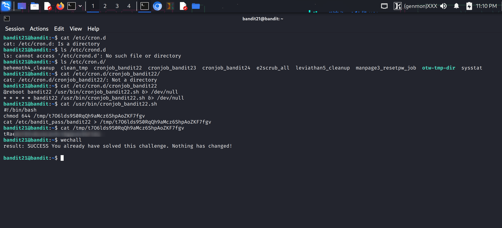

## Bandit Wargame: Level 21 → Level 22 Walkthrough

### 🎯 Level Goal

The objective of this level is to find the password for **Bandit Level 22** by analyzing a **cron job**. A cron job is a scheduled task that runs automatically on a Unix-like system. The problem description hints that the cron configuration is located in the `/etc/cron.d/` directory.

### 💡 Methodology

1.  **Locate the Cron Job**: First, list the contents of the `/etc/cron.d/` directory to identify the relevant cron job file.
2.  **Inspect the Cron Job**: Read the contents of the identified file to understand what command or script is being executed.
3.  **Analyze the Script**: The cron job points to a shell script. Inspect this script to see how it handles the password. The script will reveal where the password is being stored or what is being done with it.
4.  **Retrieve the Password**: The password is being redirected to a temporary file in the `/tmp/` directory. The script reveals the name of this file. Use the `cat` command to read the contents of this temporary file and retrieve the password.

### 💻 Commands Used

Here's the sequence of commands used to solve this level:

| Command | Purpose |
| :--- | :--- |
| `ls -la /etc/cron.d/` | List all files in the directory containing the system cron jobs. |
| `cat /etc/cron.d/cronjob_bandit22` | Display the contents of the cron job file for `bandit22`. This reveals the path to the script being run. |
| `cat /usr/bin/cronjob_bandit22.sh` | Show the source code of the script. This is where we learn that the password is being copied to a temporary file. |
| `ls -la /tmp/` | List files in the `/tmp/` directory to find the temporary file. |
| `cat /tmp/t70I6lds95QORqQh9AcmcZ6ShpAoZK7fgv` | Read the contents of the temporary file to get the password. |

### 📸 Screenshot

Here's a screenshot showing the key commands used to solve the level:

### ✅ Solution

The password for Bandit Level 22 is found in a temporary file in the `/tmp/` directory. The filename is a random string generated by the script `/usr/bin/cronjob_bandit22.sh`. The final command to retrieve the password is `cat /tmp/t70I6lds95QORqQh9AcmcZ6ShpAoZK7fgv`.
