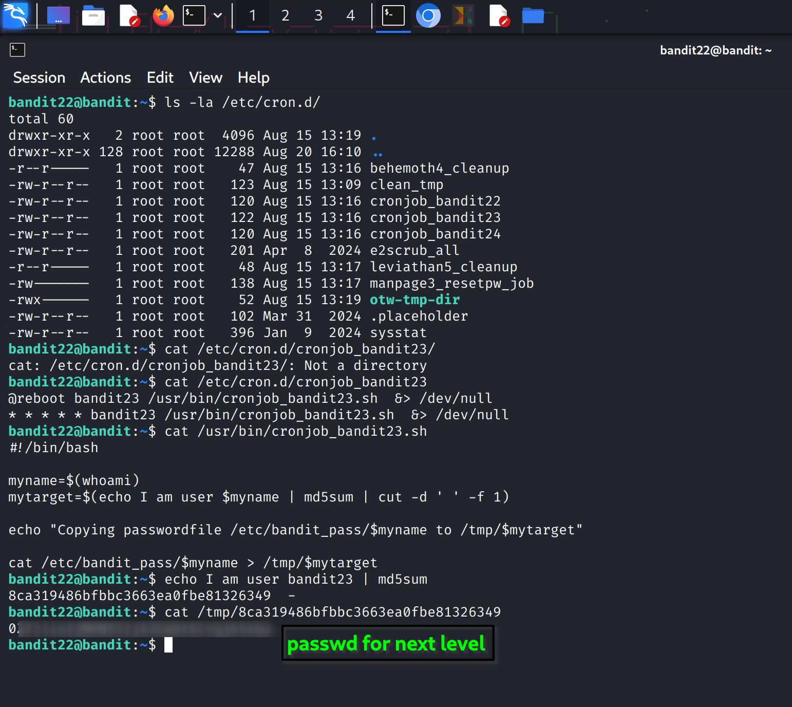

### Bandit Level 22 → Level 23 Walkthrough

The goal remains the same: find the password for **Bandit Level 23** by analyzing a cron job. The key is to understand what the script you provided does.

### 💡 Step-by-Step Analysis

1.  **Examine the Cron Job**: You've already confirmed that the cron job for `bandit23` points to the script at `/usr/bin/cronjob_bandit23.sh`. The cron job executes this script every minute as the `bandit23` user.

2.  **Analyze the Script**: The script's content is the key to solving this level. Let's break down each line:

      * `myname=$(whoami)`: This command gets the current username, which is `bandit23`, and stores it in the `myname` variable.
      * `mytarget=$(echo I am user $myname | md5sum | cut -d ' ' -f 1)`: This is the most important part.
          * `echo I am user $myname`: This creates the string "I am user bandit23".
          * `| md5sum`: This pipes the string to the `md5sum` command, which generates a unique MD5 hash (a long string of hexadecimal characters) of the string.
          * `| cut -d ' ' -f 1`: This cuts the output of `md5sum` at the space and takes the first field, which is just the hash value itself.
          * The final result, the MD5 hash, is stored in the `mytarget` variable.
      * `cat /etc/bandit_pass/$myname > /tmp/$mytarget`: This is the command that actually gives you the password. It takes the password from `/etc/bandit_pass/bandit23` and redirects it to a new file in the `/tmp/` directory. The filename is the MD5 hash calculated in the previous step.

### 🔑 Solution

To get the password, you need to replicate the steps the script takes to determine the filename.

1.  **Find the MD5 hash**: Since the script is running as the `bandit23` user, you need to find the MD5 hash of the string "I am user bandit23". You can do this yourself on the command line.

    ```bash
    bandit22@bandit:~$ echo I am user bandit23 | md5sum
    ```

    This command will output the hash, which will be the filename. The hash you get is the exact filename the password is being copied to in the `/tmp/` directory.

2.  **Retrieve the Password**: Once you have the MD5 hash, use the `cat` command to read the contents of the file in `/tmp/`. The file name is the hash you just generated.

    ```bash
    bandit22@bandit:~$ cat /tmp/<your_md5_hash_here>
    ```

    Replace `<your_md5_hash_here>` with the actual hash you generated. This will print the password for Bandit Level 23.


### 🔑 Reference Screenshot for this level:

