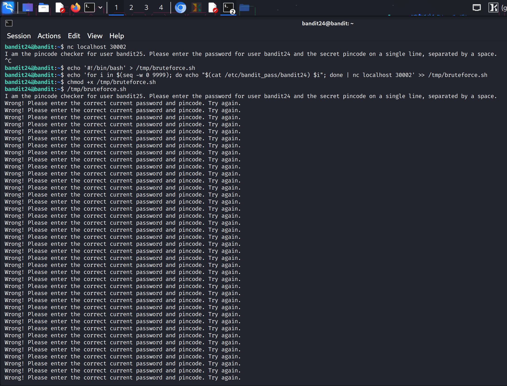
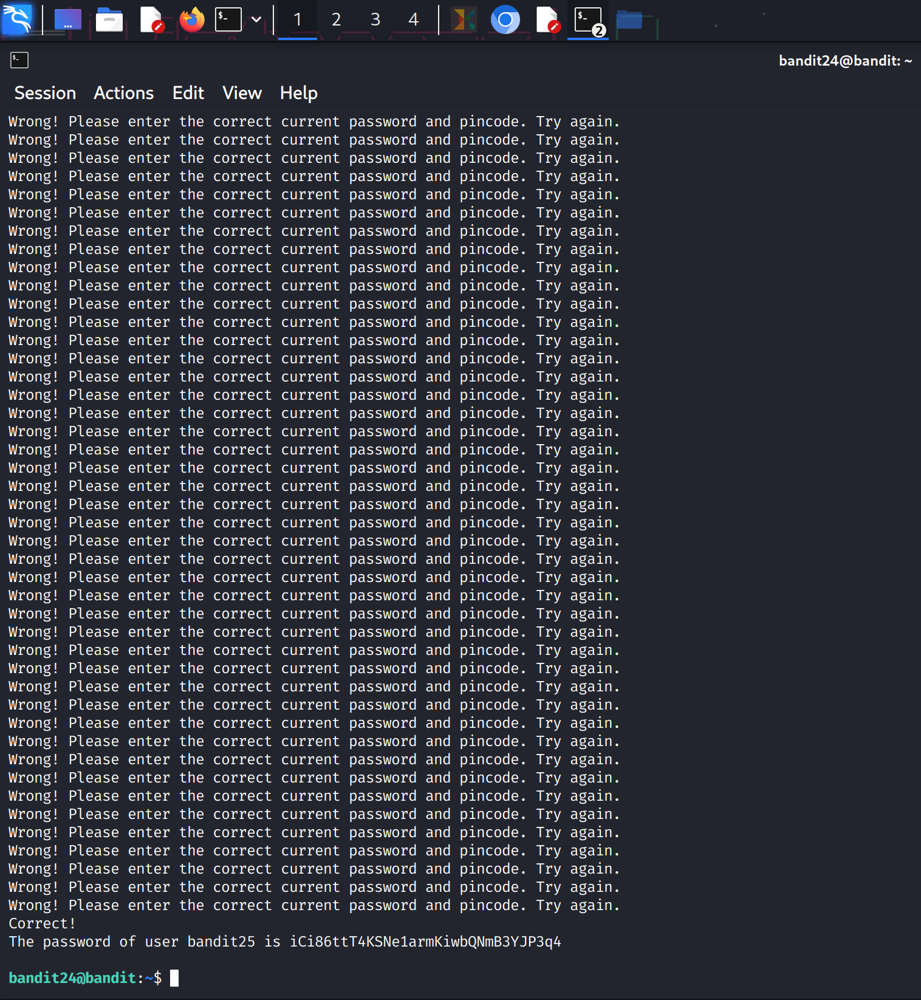

You got it\! I've added the tip with a caution emoji.

Here's the updated professional GitHub-style walkthrough for Bandit Level 24 → 25:

### Bandit Level 24 → Level 25

#### **Goal**

Use brute-force to find a 4-digit PIN and retrieve the password for the next level from a network daemon.

#### **Commands**

`netcat`, `echo`, `seq`, `chmod`

-----

### **Walkthrough**

1.  **Understand the Problem**: A daemon is running on port `30002` that requires two inputs: the password for `bandit24` and a 4-digit PIN. The only way to find the correct PIN is by systematically trying all 10,000 combinations (from `0000` to `9999`). Since you are on a restricted shell and cannot use interactive text editors, you must use a shell script created with command-line redirection.

2.  **Create the Exploit Script**: Use the `echo` and redirection (`>` and `>>`) commands to create a shell script that automates the brute-force process. The script will loop through all 4-digit numbers and pipe the password and each number to the `netcat` command.

    ```bash
    bandit24@bandit:~$ echo '#!/bin/bash' > /tmp/bruteforce.sh
    bandit24@bandit:~$ echo 'for i in $(seq -w 0 9999); do echo "$(cat /etc/bandit_pass/bandit24) $i"; done | nc localhost 30002' >> /tmp/bruteforce.sh
    ```

3.  **Make the Script Executable**: Before you can run the script, you must give it execute permissions using `chmod`.

    ```bash
    bandit24@bandit:~$ chmod +x /tmp/bruteforce.sh
    ```

4.  **Run the Brute-Force Attack**: Execute the script. It will connect to the daemon and begin sending the password with each PIN combination. The daemon will respond with "Wrong" for each incorrect guess, and the password for `bandit25` when it finds the correct PIN.

    ```bash
    bandit24@bandit:~$ /tmp/bruteforce.sh
    ```

    ⚠️ **Tip**: Be patient\! The brute-force process will send 10,000 combinations, which can take some time to complete. Wait for the loop to finish its execution. The password for Bandit 25 will be displayed in the output when the correct PIN is found.

**Screenshot for refference:**
,
