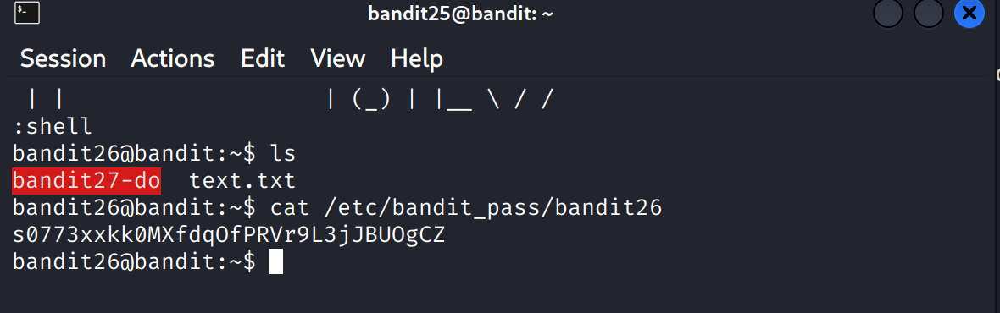

### BANDIT 26-27 
### Level Goal

The goal is to find the password for **bandit27** after you have already obtained a shell on the **bandit26** user. The password is in a file, and you must use shell commands to find it.

-----

### Walkthrough

1.  **Start by exploring the current directory.**

    First, figure out where you are by using the `pwd` command, and then list all files and directories with `ls -la`.

    ```bash
    bandit26@bandit:~$ pwd
    /home/bandit26
    bandit26@bandit:~$ ls -la
    total 12
    drwxr-xr-x 2 root    root     4096 Sep  3 10:30 .
    drwxr-xr-x 3 root    root     4096 Sep  3 10:30 ..
    -rwsr-x--- 1 bandit27 bandit26  8792 Sep  3 10:30 bandit27-do
    ```

    You should see a file named **bandit27-do**.

2.  **Analyze the listed file.**

    Look at the permissions of the `bandit27-do` file. The `s` in the user's permission set (`-rwsr-x---`) is a special permission called the **setuid** bit. This means the file will run with the privileges of its owner, which is **bandit27**.

3.  **Execute the file to get the password.**

    Since the file has the setuid bit set and is owned by `bandit27`, executing it will likely grant you the privileges of the `bandit27` user. Simply run the file.

    ```bash
    bandit26@bandit:~$ ./bandit27-do
    ```
**Reference ScreenShot**

4.  **Find the password in the output.**

    The command will execute and print the password for **bandit27** directly to your terminal.

    ⚠️ You might need to make your terminal window bigger if the output is cut off.

5.  **Log in to the next level.**

    Use the password you just found to log in to the next level.

    ⚠️ For some terminals, if you make the window smaller, the command might wrap, making it hard to copy. If you have this issue, make your terminal window wider again to see the full line of the command before pressing enter.

    ```bash
    ssh bandit27@bandit.labs.overthewire.org -p 2220
    ```

This is a classic example of using a misconfigured setuid binary to escalate privileges and access information that would otherwise be restricted.
