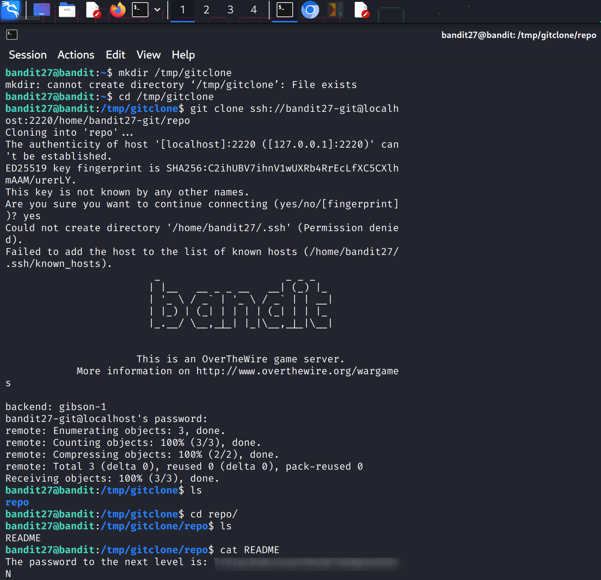

### Level Goal

The goal is to clone a Git repository, find the password for **bandit28** within the repository's history, and use it to log in.

-----

### My Notes

  * **Authentication:** The Git repository is accessed via SSH. The username is `bandit27-git`, and the password is the same as for `bandit27`.
  * **Repository Location:** The repository is located at `ssh://bandit27-git@localhost/home/bandit27-git/repo` on port `2220`.
  * **The Challenge:** The password is not in the current version of the repository but is hidden in its commit history. This means a simple `ls` or `cat` won't work. You'll need to use specific Git commands to examine past commits.

-----

### Walkthrough

1.  **Clone the Repository**

    Use the `git clone` command to download the repository to a temporary directory.

    ```bash
    mkdir /tmp/mygit
    cd /tmp/mygit
    git clone ssh://bandit27-git@localhost:2220/home/bandit27-git/repo
    ```

    You'll be prompted for the password for `bandit27-git`, which is the password you used to access the current level.

2.  **Examine the Repository**

    After cloning, `cd` into the new `repo` directory. Use `ls -la` to see the contents. You'll likely see a `README.md` file.

    ```bash
    cd repo
    ls -la
    ```

    Now, examine the commit history using `git log`.

    ```bash
    git log
    ```

    The log will show a list of commits with their messages. Look for a commit message that seems suspicious or interesting.

3.  **Find the Password**

    The commit messages often hint at where the password might be. The most recent commit often has a `README.md` file. Check this file first. If the password is not there, you'll need to check the history of the file.

    ```bash
    cat README.md
    ```

    If the password is not present, use the `git diff` command to view the changes between commits. This is where you'll find the password that was added and then removed.

    You can view the changes of a specific commit using its hash. The most recent commit will likely have a message like "`initial commit`" or "`Add password`."

    ```bash
    git show <commit_hash>
    ```

    Alternatively, you can use `git diff` to view the changes between two commits.

    ```bash
    git diff <previous_commit_hash> <current_commit_hash>
    ```

    You'll see a commit where the password was added to the `README.md` file and then removed in a later commit. The password will be marked with a `+` sign.

4.  **Log in to the Next Level**

    Copy the password and use it to log in as **bandit28**.

    ```bash
    ssh bandit28@bandit.labs.overthewire.org -p 2220
    ```
**Screenshot for Reference**

