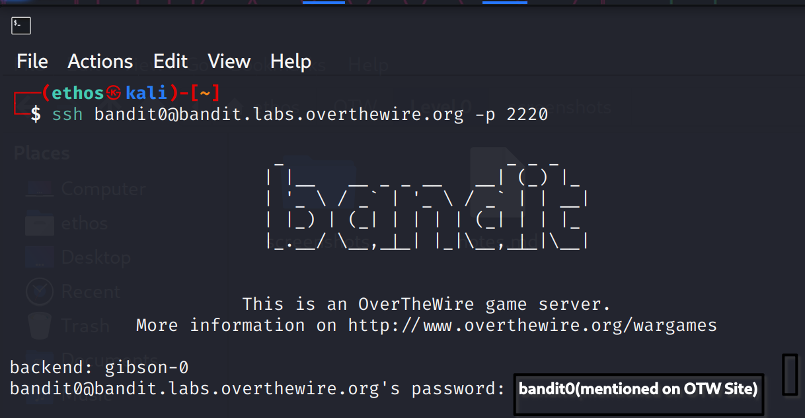
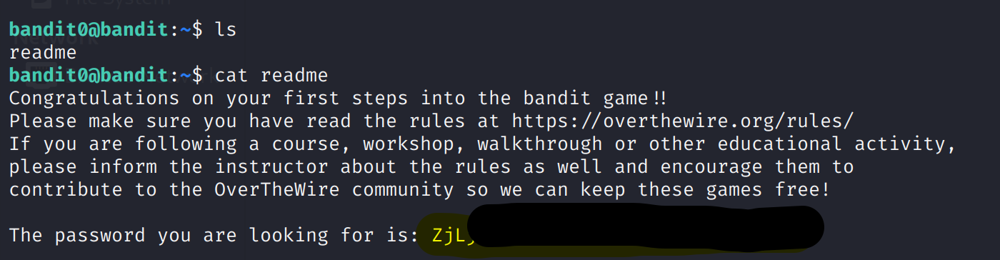

Bandit Level 0 → 1

Goal:
- Retrieve the password for Level 1.
- The password is stored in a file named 'readme' in the home directory.

Steps:
1. Log in as bandit0 (Level 0) via SSH.
2. List files in the home directory (optional):
   ls -l
3. Display the contents of the 'readme' file:
   cat readme

Result:
- The 'readme' file contains the password for Level 1.
- In this repo, we use a placeholder for security:
  PASSWORD_FOR_LEVEL_1

Screenshot:

- Make sure the password is hidden/covered if visible.
