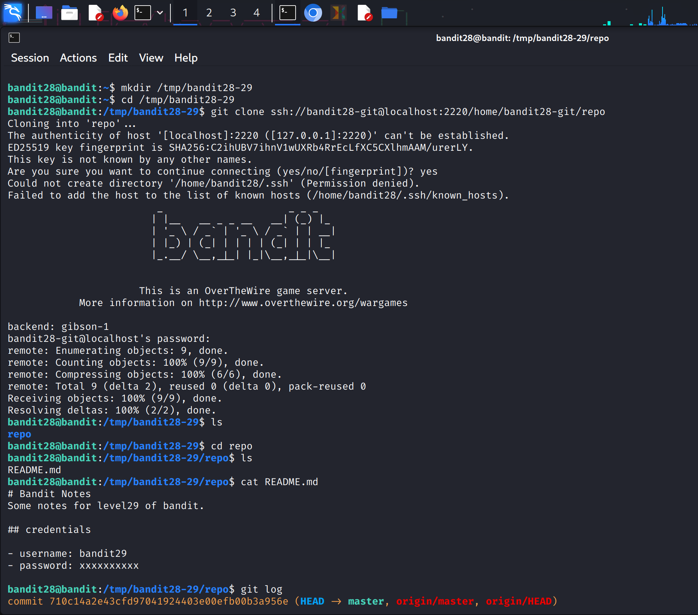
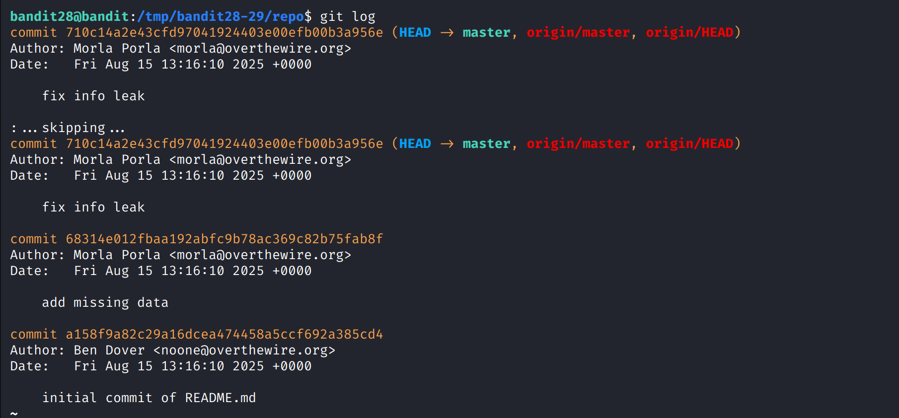
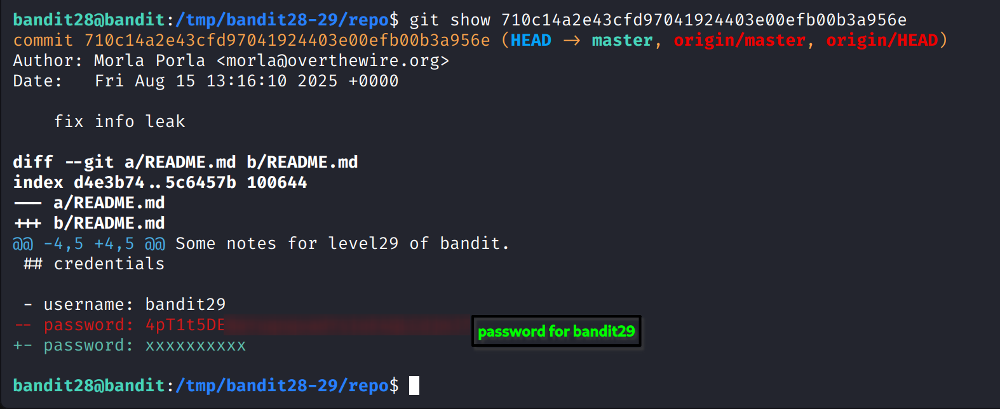

### Level Goal

The goal is to clone a Git repository and find the password for **bandit29** within the repository.

-----

### My Notes

  * **Authentication:** The Git repository is accessed via SSH. The username is `bandit28-git`, and the password is the same as for `bandit28`.
  * **Repository Location:** The repository is located at `ssh://bandit28-git@localhost/home/bandit28-git/repo` on port `2220`.
  * **The Challenge:** The password is not in the most recent commit, but in a specific branch. You'll need to explore the repository's branches to find it.

-----

### Walkthrough

1.  **Clone the Repository**

    Just like the previous level, you need to clone the Git repository.

    ```bash
    mkdir /tmp/mygit
    cd /tmp/mygit
    git clone ssh://bandit28-git@localhost:2220/home/bandit28-git/repo
    ```

    When prompted, enter the password for the `bandit28` user.
**Reference Screenshot**

2.  **Examine the Repository**

    After cloning, change your directory to the `repo` folder and use `ls -la` to see the contents. You'll likely see the same `README.md` file as before.

    ```bash
    cd repo
    ls -la
    ```

    The challenge states that the password is in a branch. The first step is to list all the branches in the repository.

    ```bash
    git branch -a
    ```

    The `-a` flag will show all branches, including remote ones. You should see a new branch, possibly named `dev`, `test`, or something similar.
**Reference Screenshot**

3.  **Find the Password**

    Now that you know the name of the new branch, you need to switch to it to view its contents.

    ```bash
    git checkout <branch_name>
    ```

    After switching branches, you can use `ls` to see if there are any new files or `cat` to view the contents of `README.md` or any other file to find the password. The password is often in a file that seems out of place, or within the text of an existing file.
**Reference Screenshot**

4.  **Log in to the Next Level**

    Once you find the password, copy it and use it to log in as **bandit29**.

    ```bash
    ssh bandit29@bandit.labs.overthewire.org -p 2220
    ```
