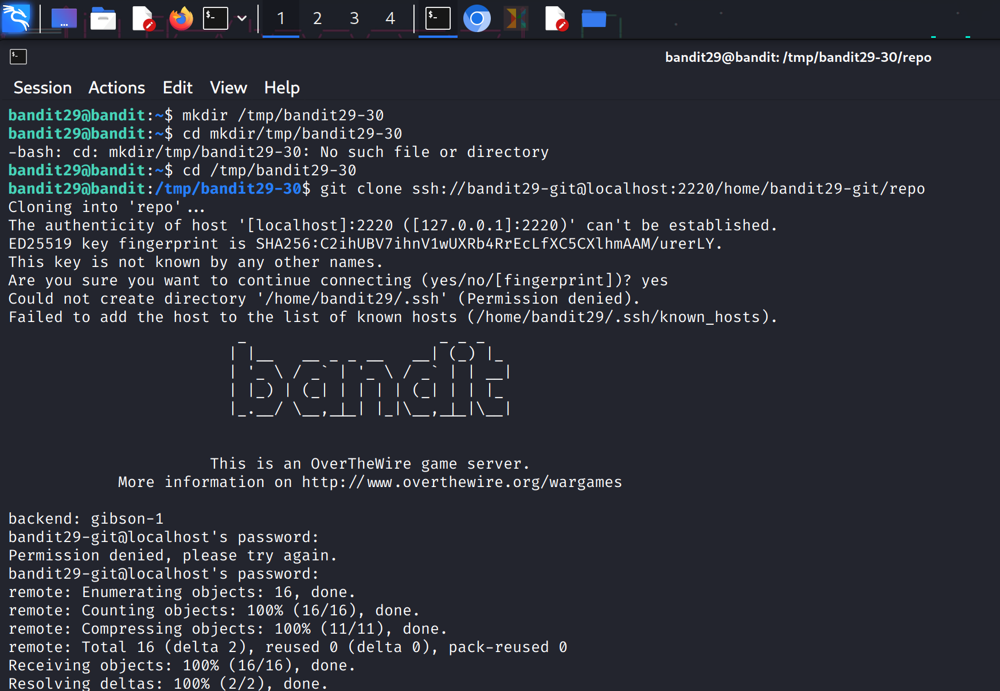
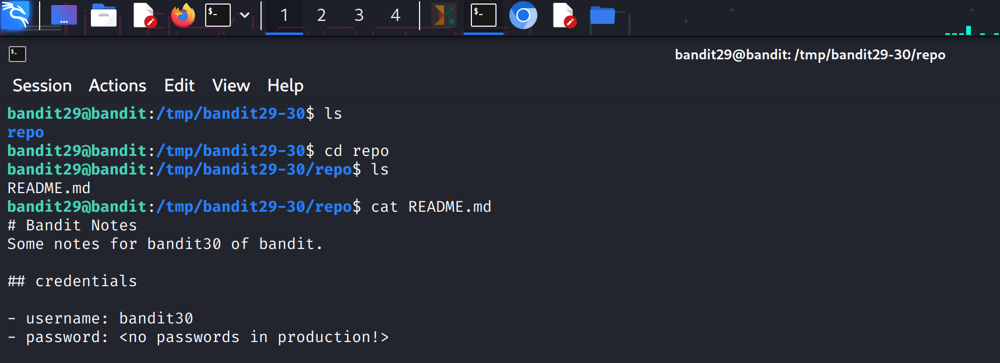
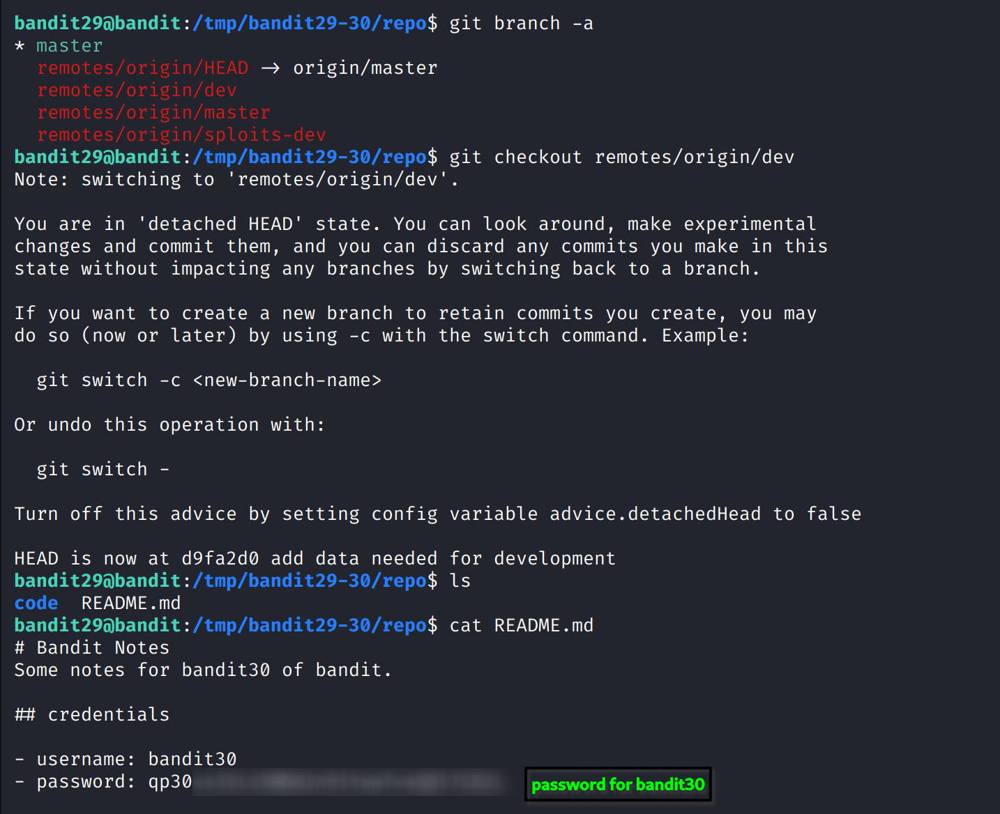

### Level Goal

The goal is to clone a Git repository and find the password for **bandit30** by exploring the repository's tags.

-----

### My Notes

  * **Authentication:** Access the Git repository via SSH. The username is `bandit29-git`, and the password is the same as for `bandit29`.
  * **Repository Location:** The repository is at `ssh://bandit29-git@localhost/home/bandit29-git/repo` on port `2220`.
  * **The Challenge:** The password is not in the master branch or another hidden branch; it's located in a **tag**. Git tags are used to mark specific points in the repository's history as important.

-----

### Walkthrough

1.  **Clone the Repository**

    As in previous levels, start by cloning the repository to a temporary directory.

    ```bash
    mkdir /tmp/bandit-git
    cd /tmp/bandit-git
    git clone ssh://bandit29-git@localhost:2220/home/bandit29-git/repo
    ```

    Enter the password for the `bandit29` user when prompted.

**SCREENSHOT FOR REFERENCE**


2.  **Examine the Repository**

    Navigate into the new `repo` directory. The password is not in the current files, so you need to look at the repository's history. To see if there are any tags, use the `git tag` command.

    ```bash
    cd repo
    git tag
    ```

    This will list any tags that exist in the repository. You will likely see a tag named something like `secret`.

**SCREENSHOT FOR REFERENCE**



3.  **Find the Password**

    Once you have identified the tag, you can inspect it to find the password. Use the `git show` command with the tag name.

    ```bash
    git show <tag_name>
    ```

    The command will display the commit and its contents that the tag is pointing to. You should see a section showing changes to a file and the new content, which includes the password for the next level.

**SCREENSHOT FOR REFERENCE**


4.  **Log in to the Next Level**

    Copy the password and use it to log in as **bandit30**.

    ```bash
    ssh bandit30@bandit.labs.overthewire.org -p 2220
    ```
