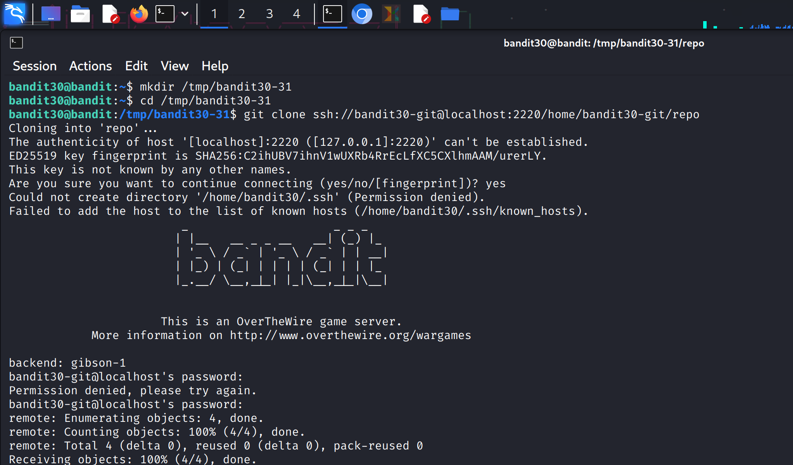
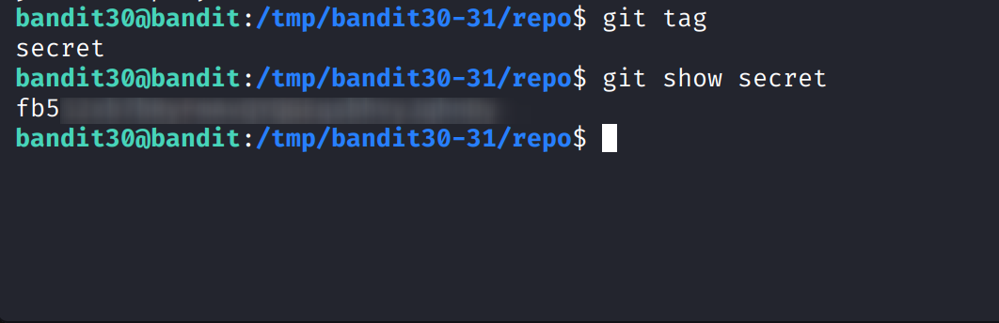

### Level Goal

The goal is to clone a Git repository and find the password for **bandit31** within a file that has a specific commit ID.

-----

### My Notes

  * **Authentication:** The Git repository is accessed via SSH. The username is `bandit30-git`, and the password is the same as for `bandit30`.
  * **Repository Location:** The repository is located at `ssh://bandit30-git@localhost/home/bandit30-git/repo` on port `2220`.
  * **The Challenge:** The password is in a file that was deleted from the repository. You can only find it by examining a specific commit's content.

-----

### Walkthrough

1.  **Clone the Repository**

    First, clone the repository to a temporary directory.

    ```bash
    mkdir /tmp/bandit-git-30
    cd /tmp/bandit-git-30
    git clone ssh://bandit30-git@localhost:2220/home/bandit30-git/repo
    ```

    You'll be prompted for the password for `bandit30-git`, which is the same as the password for `bandit30`.

**SCREENSHOT REFERENCE**



2.  **Examine the Repository History**

    Navigate into the cloned `repo` directory. The goal description for this level is a bit of a clue. It mentions a specific commit ID. This means you need to examine the commit history to find it.

    ```bash
    cd repo
    git log
    ```

    Look through the output of `git log` for any interesting commit messages or for the specific commit ID mentioned in the challenge's hint. You may see a commit with a message like "`Delete password file`."


**SCREENSHOT REFERENCE**


3.  **Find the Password**

    Once you have identified the commit ID, you can use the `git show` command to inspect its contents. `git show` can be used to view the content of any commit, even if the files were deleted.

    ```bash
    git show <commit_id>
    ```

    The `git show` command will display the details of the commit, including the diff of the changes. The password will be listed as a change that was deleted from a file. You can also view the file content directly at that specific commit.

    Alternatively, you can use `git log --all` to see the full commit history, and `git cat-file -p <commit_id>:<file_path>` to view the contents of a file at that specific commit.

**SCREENSHOT REFERENCE**


    The password will be the string that was added to the file and then deleted.

4.  **Log in to the Next Level**

    Copy the password and use it to log in as **bandit31**.

    ```bash
    ssh bandit31@bandit.labs.overthewire.org -p 2220
    ```
