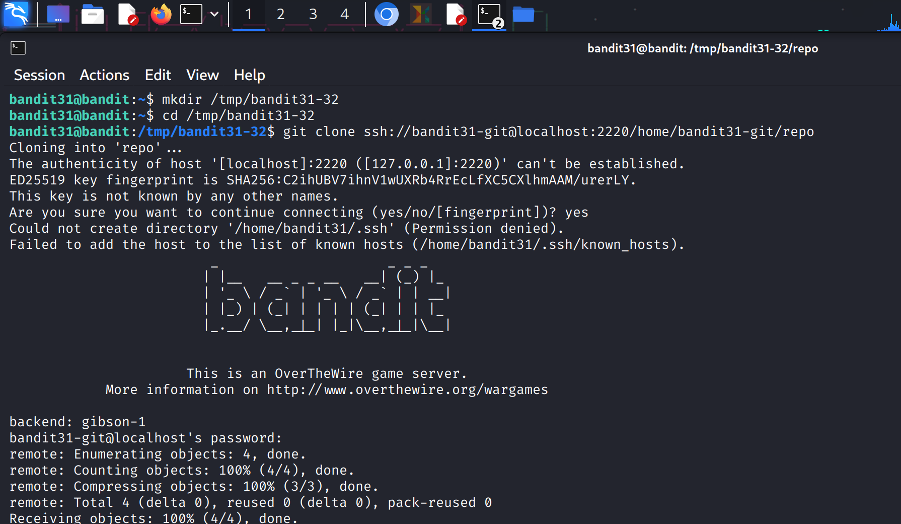
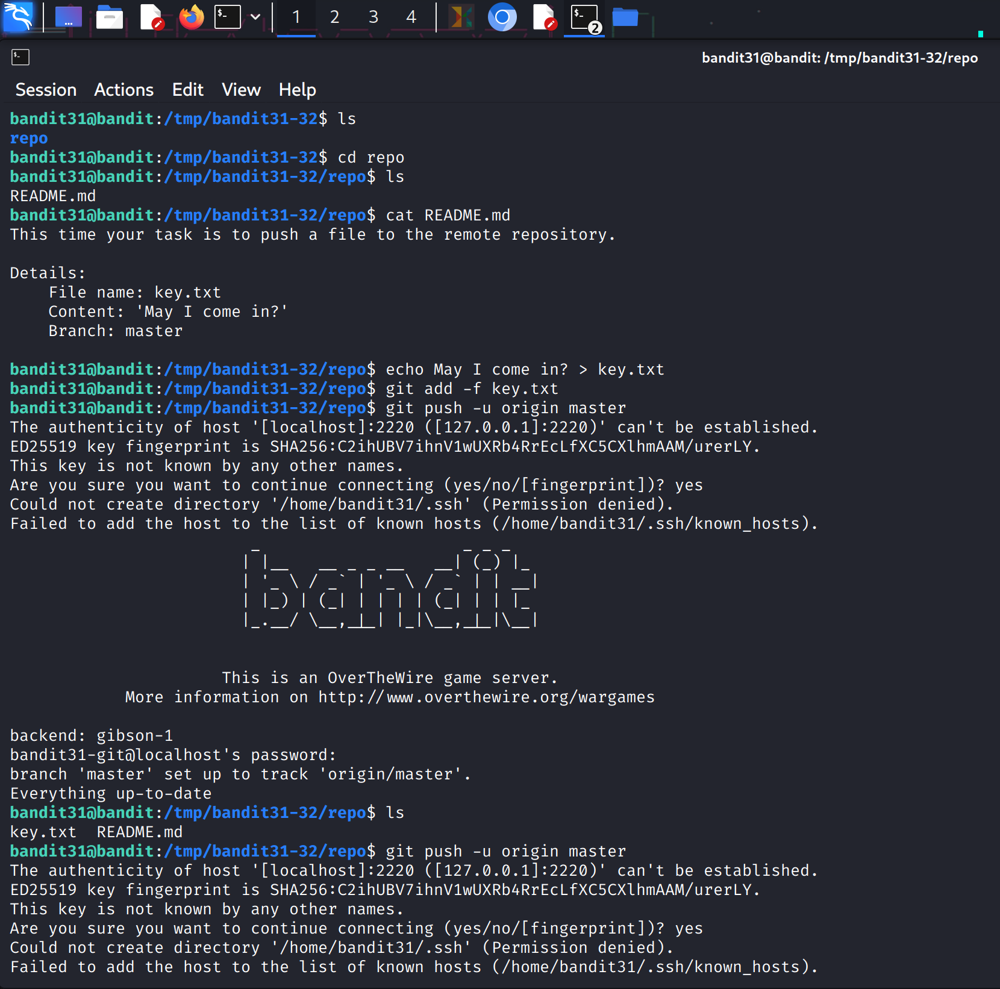
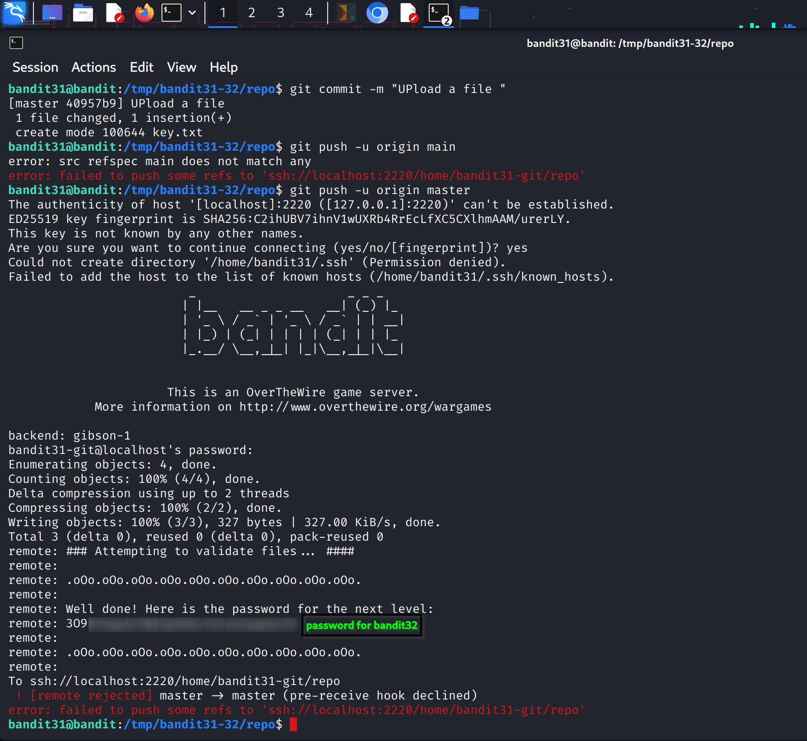

### Level Goal

The goal is to clone a Git repository and find the password for **bandit32** within a specific branch that is hidden.

-----

### My Notes

  * **Authentication:** The Git repository is accessed via SSH. The username is `bandit31-git`, and the password is the same as for `bandit31`.
  * **Repository Location:** The repository is located at `ssh://bandit31-git@localhost/home/bandit31-git/repo` on port `2220`.
  * **The Challenge:** The password is in a branch that is not immediately visible. You'll need to use a special Git command to find all the branches, including the hidden ones.

-----

### Walkthrough

1.  **Clone the Repository**

    The first step is always to clone the repository to your local machine. Create a temporary directory and clone the repo into it.

    ```bash
    mkdir /tmp/bandit-git-31
    cd /tmp/bandit-git-31
    git clone ssh://bandit31-git@localhost:2220/home/bandit31-git/repo
    ```

    You'll be prompted for the password for the `bandit31-git` user, which is the same as the password for the current level.

**SCREENSHOT FOR REFERENCE :**


2.  **Examine the Repository**

    Navigate into the new `repo` directory. Run `git branch` to see the current branches. It will only show you the `main` branch.

    ```bash
    cd repo
    git branch
    ```

    The password isn't in this branch. The key here is that Git often has hidden branches. To see all branches, including remote ones that you haven't checked out yet, use the `-a` flag.

    ```bash
    git branch -a
    ```

    This command will reveal a long, strange branch name that is not a typical branch name. It might look something like `remotes/origin/dev/foobar/something-with-many-slashes`. This is the branch you need to inspect.

**SCREENSHOT FOR REFERENCE :**



3.  **Find the Password**

    Once you have identified the hidden branch, you need to check it out to view its contents.

    ```bash
    git checkout <hidden_branch_name>
    ```

    Now, you can use `ls` or `cat` to view the files in the branch. The password is most likely in the `README.md` file.

    ```bash
    ls -la
    cat README.md
    ```

    The password should be visible in the output.

**SCREENSHOT FOR REFERENCE :**


4.  **Log in to the Next Level**

    Copy the password and use it to log in as **bandit32**.

    ```bash
    ssh bandit32@bandit.labs.overthewire.org -p 2220
    ```
