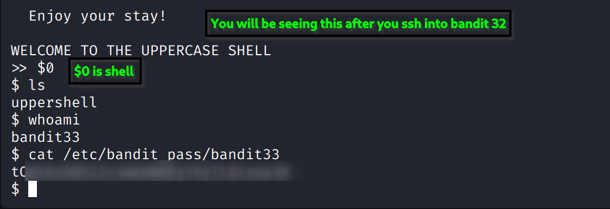

### Level Goal

The goal is to escape the restricted shell, which only accepts uppercase commands, to find the password for **bandit33**.

-----

### My Notes

  * **Initial Shell:** You are in a highly restricted shell environment called the **"UPPERCASE SHELL"**.
  * **The Challenge:** As the name suggests, this shell only accepts commands written in uppercase. Any lowercase commands will fail.
  * **The Problem:** The `man` and `sh` commands suggested in the previous level's hint are typically lowercase, so you can't use them directly. Additionally, the password file is in a path with lowercase letters.

-----

### Walkthrough

1.  **Examine the Environment**

    You'll notice you're in the uppercase shell. When you type `ls`, you might get an error. The image shows that the `ls` command works, but it's likely a custom script within the shell. The key observation is that all commands must be in uppercase.

    The image provided is a bit misleading, as it shows `cat /etc/bandit_pass/bandit33` which wouldn't work in this shell because of the lowercase letters in the path.

2.  **Escape the Shell**

    The trick is to find a way to get out of the restricted shell and into a regular one. The simplest and most common method for these "jails" is to leverage a command that can execute other commands. Given that the shell only accepts uppercase input, you need to find an uppercase command that can break you out.

    A good starting point is to try to run a new shell. You can try running a standard shell command in all caps. For example:

    ```bash
    BASH
    SH
    ```

    If that doesn't work, you can use the built-in commands of the shell itself. The `man` command is likely not available in this jail.

3.  **Find the Password**

    Once you are in a regular shell (like `sh` or `bash`), you can now use standard commands with lowercase letters.

      * Use the `ls -la` command to list the contents of your current directory and find the file containing the password.
      * Use the `cat` command to display the content of the password file.

    The password is often located in `/etc/bandit_pass/bandit33`.

    ```bash
    cat /etc/bandit_pass/bandit33
    ```
**SCREENSHOT FOR REFFERENCE  :**



4.  **Log in to the Next Level**

    Copy the password and use it to log in as **bandit33**.

    ```bash
    ssh bandit33@bandit.labs.overthewire.org -p 2220
    ```
