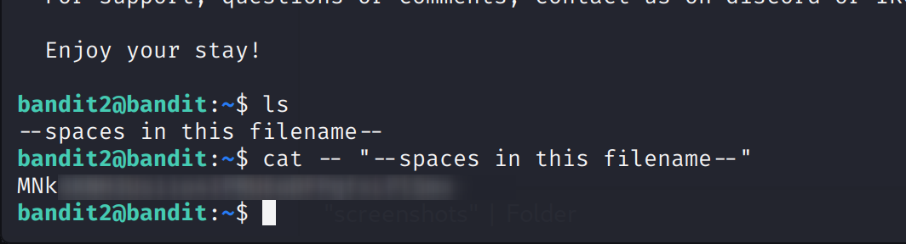

Bandit Level 2 → 3

Goal:
- Retrieve the password for Level 3.
- The password is stored in a file called '--spaces in this filename--' in the home directory of Level 2.

Commands You May Need:
ls, cd, cat, file, du, find

Steps:
1. Log in as bandit2 (Level 2) via SSH.
2. List files in the home directory:
   ls
   # Output: --spaces in this filename--
3. Read the file safely:
   cat -- "--spaces in this filename--"

Explanation:
- The first `--` tells the `cat` command that everything following it is a **filename**, not a command option.
- This is necessary because filenames starting with `-` or `--` could be interpreted as options by Linux commands.
- Quotes `"..."` are used to handle spaces in the filename.

Result:
- The file contains the password for Level 3.
- In this repo, the password is **blurred for security** in screenshots.

Screenshot:

- The screenshot shows only the command; password is blurred.
