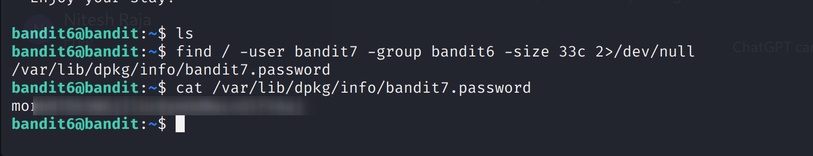

Bandit Level 6 → Level 7

Goal:
Find the password for the next level. The password is stored in a file somewhere on the server that meets all of the following criteria:
- Owned by user: bandit7
- Owned by group: bandit6
- 33 bytes in size

Useful Commands:
ls, cd, cat, file, du, find, grep

Steps and Explanation:

1. Use find to locate the file:
find / -user bandit7 -group bandit6 -size 33c 2>/dev/null

Explanation:
- / → start searching from the root directory (search the entire server)
- -user bandit7 → filter files owned by user bandit7
- -group bandit6 → filter files belonging to group bandit6
- -size 33c → find files exactly 33 bytes in size (c = bytes)
- 2>/dev/null → suppress permission denied errors so output is clean

This command will return the full path of the file containing the password.

2. Read the password:
cat /path/to/file

Explanation:
- Replace /path/to/file with the actual path returned by find
- cat prints the contents of the file, which is the password for Level 7

Level 6 → 7 Password:
Password is blurred in screenshot.

Output Screenshot:

password is blurred for security in screenshot 
