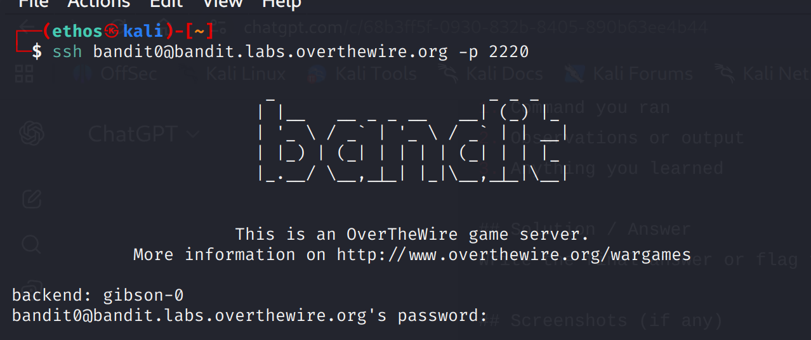
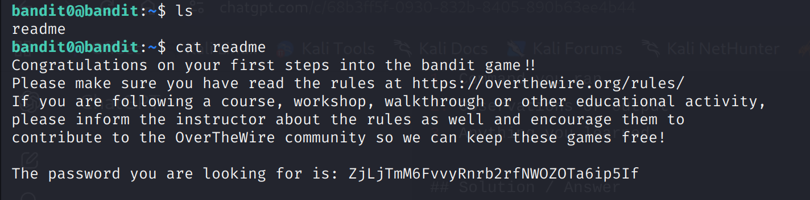

Bandit Level 0 Notes
#Goal
Connect to the Bandit server using SSH and retrieve the password for Level 1.

---

 Steps Taken

1. **SSH into the server**

ssh bandit0@bandit.labs.overthewire.org -p 2220

 Password: `bandit0` (provided by OTW)
 Connected successfully.

---

2. **List files and find the password**

* Checked the contents of the home directory:
ls
ls command lists all the contents of the current directory(Home)
* Found a file named "readme"

* Viewed the contents of the file to get the password:

cat readme
cat stands for concatenate and is used to Display the contents of a file to the terminal.
Here Displays the content of readme on the terminal.

## Solution / Password for Level 1
ZjLjTmM6FvvyRnrb2rfNWOZOTa6ip5If

## Important Note
- Always check the home directory first for files.
- `ls -l` can show file permissions and details.
- Screenshots help remember SSH connections and commands used.

