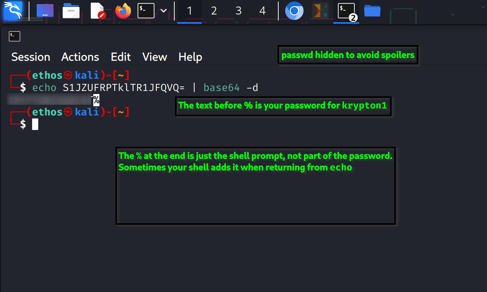
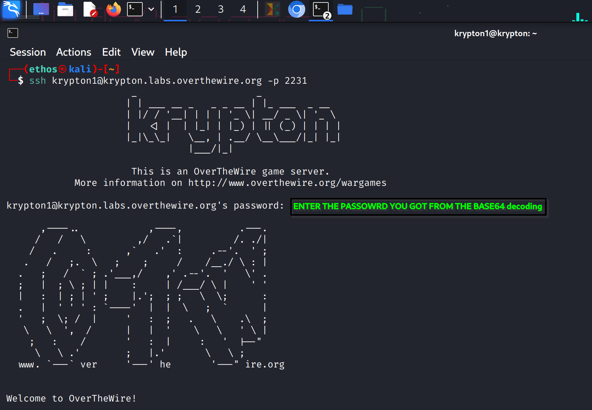

# Krypton Level 0 → Level 1
## Objective
- Decode the given Base64 string to get the password for Level 1.
- Log in to the Krypton server using SSH.
## Given
Base64 encoded password:
```
S1JZUFRPTklTR1JFQVQ=
```
## Steps / Commands
⚠️ **Caution:** The Base64 decoding must be done **locally in your terminal** before attempting to SSH into the Krypton server. Do not try to SSH first without decoding the password.
### 1️⃣ Decode Base64 to get the password
```bash
echo S1JZUFRPTklTR1JFQVQ= | base64 -d
```
## SCREENSHOT FOR REFERENCE



**Explanation:**  
- `echo` prints the string to STDOUT.  
- `|` pipes it to the next command.  
- `base64 -d` decodes Base64 input to plain text.  
- Output: `<THE STRING YOU OBTAINED DECODING BASE64>` (this is the password for Level 1).  
> Note: The `%` you see after decoding is the shell prompt, not part of the password.
### 2️⃣ SSH into Level 1
```bash
ssh krypton1@krypton.labs.overthewire.org -p 2231
```
- Username: `krypton1`  
- Password: `<PASSWORD YOU OBTAINED DECODING BASE64>`  

## SCREENSHOT FOR REFERENCE 



You should now be logged in and ready to start Level 1.
## Key Concepts Learned
- Base64 encoding/decoding  
- Using `echo` and `pipe` to feed data into commands  
- Basic SSH login to a custom port
## Notes / Tips
- Always decode passwords carefully — extra whitespace or shell prompt symbols are not part of the password.  
- Understanding Base64 is essential for future Krypton levels.  
- Keep a personal cheatsheet of commands used for quick reference in later levels.


