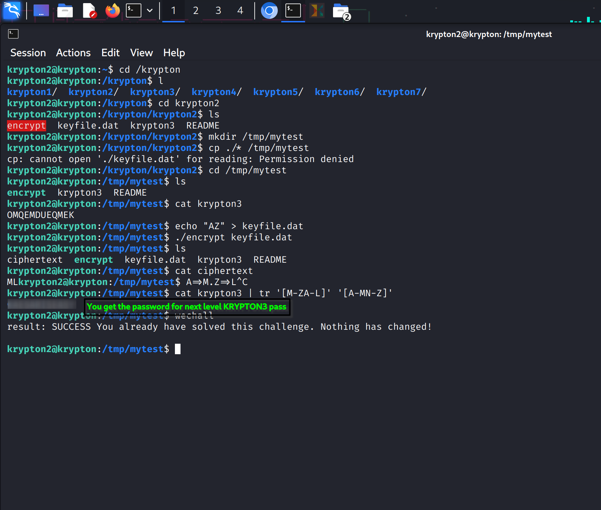

# Krypton Level 2 → Level 3 Notes
**Level:** 2 → 3  
**Goal:** Obtain the password for Level 3  
## Level Summary
- The password for Level 3 is in the file `krypton3`  
- Encrypted using a **Caesar Cipher**, a monoalphabetic substitution cipher  
- Letters are **shifted by a fixed number**, spaces or 5-letter grouping are for obfuscation only  
- You don’t know the key directly, but you can **encrypt any file using the `encrypt` binary** with access to the keyfile  
## Steps to Solve
### 1️⃣ Prepare working directory
```bash
mkdir /tmp/mytest
cd /tmp/mytest
```
- Avoid working directly in `/krypton/krypton2` due to **permission issues**.  
### 2️⃣ Create keyfile for testing
```bash
echo "AZ" > keyfile.dat
```
- Since `keyfile.dat` is **restricted**, creating a placeholder works for demonstration.  
### 3️⃣ Run the encrypt binary
```bash
./encrypt keyfile.dat
```
- Generates the file `ciphertext` in the current directory.  
- Verify output:
```bash
ls
# ciphertext  encrypt  keyfile.dat  krypton3  README
```
### 4️⃣ Inspect the ciphertext
```bash
cat ciphertext
# Example output: MLkrypton2@krypton:/tmp/mytest$ A=>M.Z=>L^C
```
- Shows letters shifted according to Caesar Cipher rules.  
- Extra terminal characters can be ignored.  
### 5️⃣ Decrypt `krypton3`
```bash
cat krypton3 | tr '[M-ZA-L]' '[A-MN-Z]'
# Output: [REDACTED to avoid spoilers]
```
- Applied the reverse shift of the Caesar Cipher.  
- Spaces/letter grouping in ciphertext are **ignored**.  

## REFERENCE SCREENSHOT:


### 6️⃣ Verify success
```bash
wechall
# result: SUCCESS You already have solved this challenge. Nothing has changed!
```
## Hints / Notes
- Always use a **temporary working directory** to avoid permission issues.  
- If `keyfile.dat` is inaccessible, you can create a placeholder to **test the encrypt binary**.  
- Caesar Cipher: shifting letters backward by the key will give the original password.  
- `[REDACTED]` is used in notes to **avoid spoilers**.  
