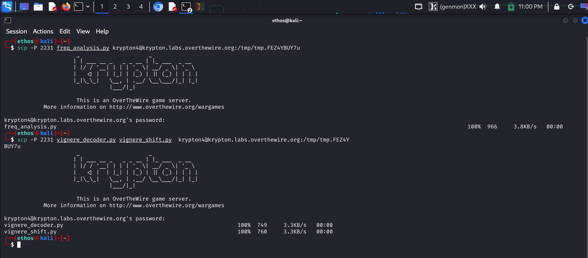
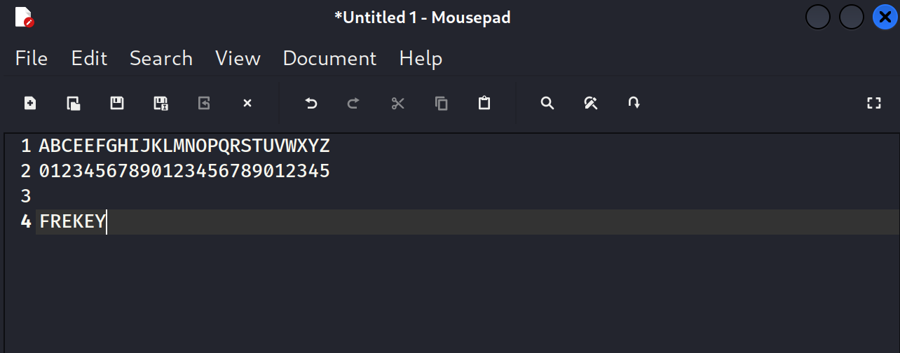
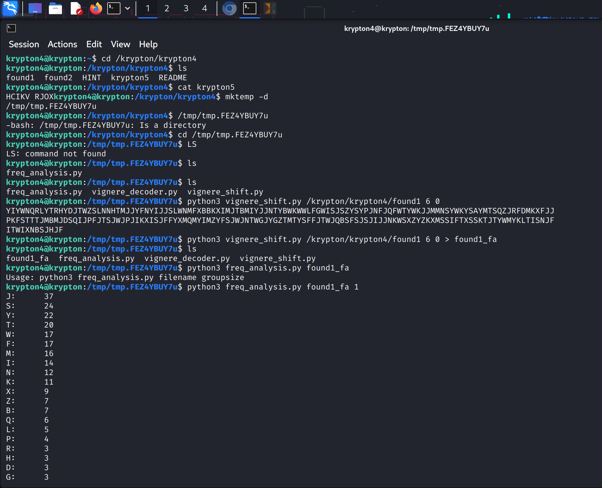
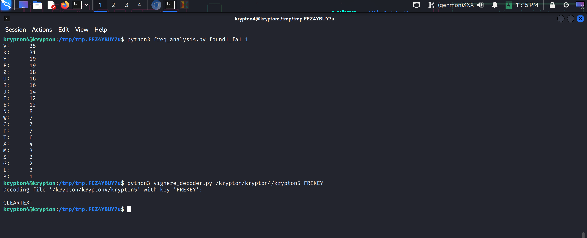

# Krypton: Level 4 → Level 5 Walkthrough

This level introduces the **Vigenère cipher**, a polyalphabetic substitution cipher. Unlike a simple Caesar cipher where 'A' always maps to the same letter, the Vigenère cipher uses a keyword to shift letters by different amounts, making it much stronger against basic frequency analysis. 🕵️‍♂️

## Key Concepts

  * **Polyalphabetic Cipher**: A character in the plaintext (e.g., 'E') can be encrypted to multiple different characters in the ciphertext, depending on its position.
  * **Vigenère Method**: It uses a keyword to apply a series of interleaved Caesar ciphers. If the keyword is "KEY", the 1st letter is shifted by 'K', the 2nd by 'E', the 3rd by 'K', the 4th by 'K' again, and so on.
  * **The Vulnerability**: The main weakness is the repeating nature of the key. If you know the key's length, you can attack the cipher.

**The goal is to find the 6-letter key used to encrypt the files `found1`, `found2`, and `krypton5`.**

-----

## The Strategy

Since we are told the key length is **6**, we can split the ciphertext into 6 different groups.

  * **Group 1**: The 1st, 7th, 13th, 19th... characters.
  * **Group 2**: The 2nd, 8th, 14th, 20th... characters.
  * ...and so on for all 6 groups.

All the letters in a single group (e.g., Group 1) have been encrypted using the **same letter** from the key (the 1st letter of the key). This means each group is effectively a simple Caesar cipher, which is vulnerable to **frequency analysis**.

We will perform frequency analysis on each of the 6 groups. Since the plaintext is English, the most frequent letter is likely to be 'E'. By finding the most common letter in each ciphertext group, we can assume it corresponds to 'E' and calculate the key character for that position.

-----

## Step-by-Step Solution

### Step 1: Prepare the Environment
The files you might need 

[freq_analysis.py](freq_analysis.py)    

[vignere_shift](vignere_shift.py)


[vignere_decoder.py](vignere_decoder.py)

To automate the analysis, a few helper scripts are useful. I used `scp` to transfer Python scripts for frequency analysis and Vigenère decoding to a temporary directory on the server.

```bash
scp -P 2231 freq_analysis.py vignere_decoder.py vignere_shift.py krypton4@krypton.labs.overthewire.org:/tmp/FEZ4YBUY7u
```

## REFERENCE SCREENSHOT:


### Step 2: Isolate and Analyze Each Character Group

We'll use a script to split the `found1` ciphertext into 6 groups based on the key length and then run frequency analysis on each group one by one.

Let's start with the first group (index 0).

1.  **Isolate the first group of characters:**
    ```bash
    python3 vigenere_shift.py /krypton/krypton4/found1 6 0 > found1_fa
    ```
2.  **Run frequency analysis on this group:**
    ```bash
    python3 freq_analysis.py found1_fa 1
    ```

## REFERENCE SCREENSHOT:





The analysis shows that **'J'** is the most frequent character in this group.

### Step 3: Determine the Key

We assume the most frequent ciphertext letter corresponds to the most frequent plaintext letter ('E').

  * **Plaintext:** E = 4 (A=0, B=1, C=2...)
  * **Ciphertext (Group 1):** J = 9

To find the key letter, we use the formula: $Key = (Ciphertext - Plaintext) \\pmod{26}$

  * **Key Letter 1:** $(9 - 4) \\pmod{26} = 5$. The 5th letter of the alphabet is **F**.

By repeating this process for the other 5 groups, we find the most frequent letter in each and calculate the corresponding key character. This reveals the full key.

After analyzing all 6 groups, the full key is found to be **FREKEY**.

## REFERENCE SCREENSHOT:


### Step 4: Decrypt the Password

With the key in hand, we can now decrypt the password file `krypton5`.

```bash
python3 vignere_decoder.py /krypton/krypton5 FREKEY
```

## REFERENCE SCREENSHOT:


This command decrypts the file and reveals the password for the next level.

**Password for Krypton 5:** `CLEARTEXT`


