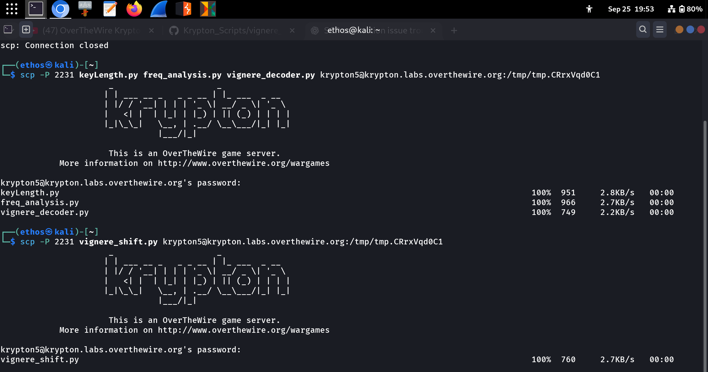

# Krypton: Level 4 → Level 5

This level is a **Vigenère cipher** where the key length is given as **6**. The strategy is to split the ciphertext into six parts and solve each part as a simple Caesar cipher using frequency analysis.

-----

## Terminal Walkthrough

### Step 1: Transfer Analysis Scripts to Server

First, copy your helper scripts to the Krypton server using `scp`.

```bash
(ethos@kali)-[~]
└─$ scp -P 2231 freq_analysis.py vignere_shift.py vignere_decoder.py krypton5@krypton.labs.overthewire.org:/tmp/tmp.CRrxVqdOC1

krypton5@krypton.labs.overthewire.org's password:
freq_analysis.py          100%  966   2.7KB/s   00:00
vignere_shift.py          100%  760   2.7KB/s   00:00
vignere_decoder.py        100%  749   2.2KB/s   00:00
```
## SCREENSHOT REFFERENCE:




### Step 2: Split the Ciphertexts

Now, SSH into the server. For each of the six key positions (0 through 5), create a file containing the corresponding letters from the ciphertexts (`/krypton/krypton5/found1` and `found2`).

```bash
krypton5@krypton:/tmp/tmp.CRrxVqdOC1$ python3 vignere_shift.py /krypton/krypton5/found1 6 0 > found1_shift0
krypton5@krypton:/tmp/tmp.CRrxVqdOC1$ python3 vignere_shift.py /krypton/krypton5/found2 6 0 > found2_shift0
```

*You would repeat this for positions 1, 2, 3, 4, and 5.*

-----

### Step 3: Run Frequency Analysis

For each position, combine the split files and run your frequency analysis script. The most frequent letter that appears is likely the encrypted version of 'E'.

```bash
krypton5@krypton:/tmp/tmp.CRrxVqdOC1$ cat found1_shift0 found2_shift0 | python3 freq_analysis.py

O:      24
Y:      22
K:      20
D:      18
... (and so on)
```
## SCREENSHOT REFFERENCE:


## SCREENSHOT REFFERENCE:


In this example for position 0, the most frequent letter is **'O'**.

-----

### Step 4: Calculate the Key 🔑

Repeat Step 3 for all six positions. For each one, calculate the key letter by finding the shift from 'E' to the most frequent ciphertext letter.

  * **Position 0**: Most frequent is 'O'. The shift is `('O' - 'E') mod 26` which is `(14 - 4) = 10`. The 10th letter is **F**.
  * **Position 1**: Analysis reveals the shift corresponds to **R**.
  * **Position 2**: Analysis reveals the shift corresponds to **E**.
  * **Position 3**: Analysis reveals the shift corresponds to **K**.
  * **Position 4**: Analysis reveals the shift corresponds to **E**.
  * **Position 5**: Analysis reveals the shift corresponds to **Y**.

This gives you the complete 6-letter key: **`FREKEY`**.

-----

### Step 5: Decrypt the Password

Finally, use the key `FREKEY` to decrypt the password file.

```bash
krypton5@krypton:/tmp/tmp.CRrxVqdOC1$ python3 vignere_decoder.py /krypton/krypton5/krypton6 FREKEY

RANDOM
```

The command outputs the password for Level 5.
